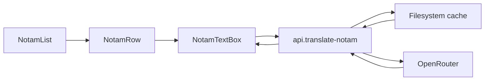

# NOTAM LLM Translations - Solution Design

## Owning Code Paths
- FAA NOTAM fetch remains in `app/.server/notamList.ts`.
- Translation action lives in `app/routes/api.translate-notam.ts`.
- OpenRouter and output validation live in `app/.server/notamTranslation.ts`.
- Filesystem cache lives in `app/.server/notamTranslationCache.ts`.
- Row display lives in `app/components/notams/NotamRow.tsx` and `app/components/notams/NotamTextBox.tsx`.

## Data Flow

## Translation Contract
- Client sends NOTAM identity fields and raw text to the resource action.
- Server hashes normalized NOTAM identity, text, model ID, and schema version.
- Cache hits return the prior deterministic HTML.
- Cache misses call OpenRouter with JSON Schema structured output.
- Server validates text fields, escapes all content, and renders the final HTML template.

## UI State Model
- `idle`: raw text visible, explanation can be requested.
- `loading`: raw text visible, icon shows progress.
- `ready`: raw text remains default; user can toggle AI explanation.
- `timeout` / `error` / `invalid`: raw text visible, retry after cooldown.
- `unavailable`: raw text visible, AI action disabled.
